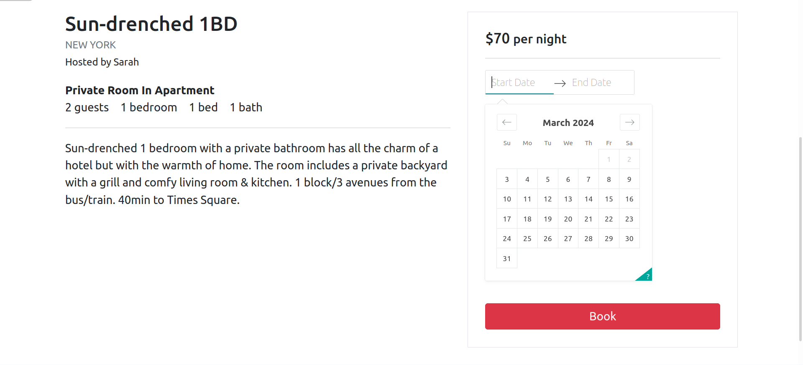
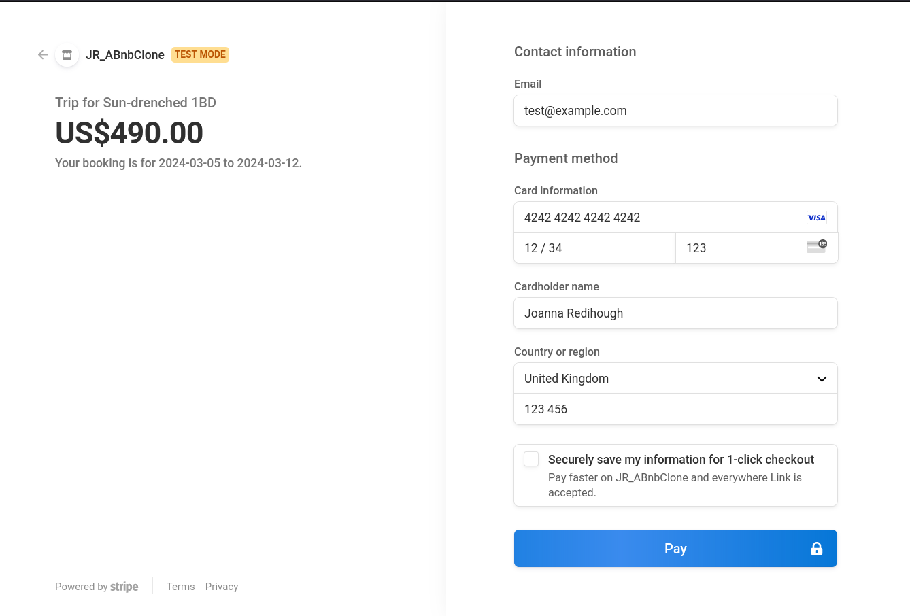
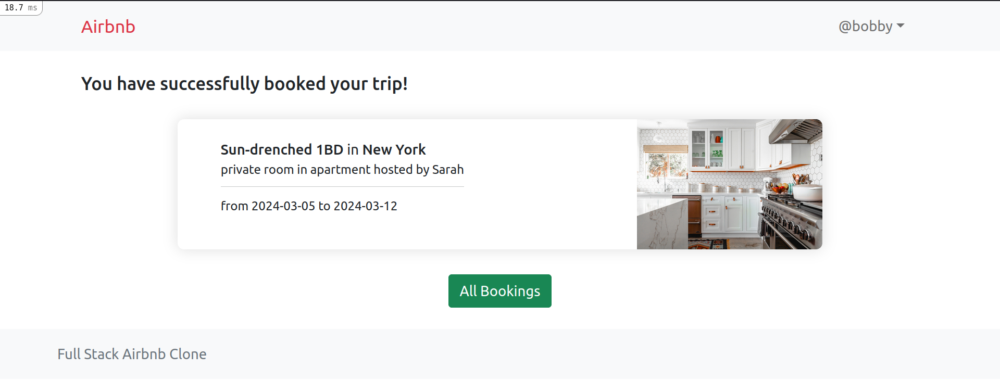

# Full Stack Airbnb Clone

Built with **React**, **Ruby on Rails** and **Sass**, using **Stripe** for payment. A full stack project for altcademy's web development course.

## Features


* User authentication
* The user can **book properties**
* **[Stripe](https://docs.stripe.com/)** integration for payments

### Make a booking


### Payment with Stripe


### Complete a booking


## Versions

* Ruby 3.0.3
* Rails 6.1.5
* Node 17.0.23
* Webpacker 5.4.3
* Bootstrap 5

## Local development

1. Install GEMS

```
bundle
```

2. Install NPM packages

```
yarn
```

3. Start rails server

```
rails s
```

Or use foreman if you have it installed, it will run rails server and webpack dev server

```
foreman start -f Procfile.dev
```

4. Go to "localhost:3000" on browser.
